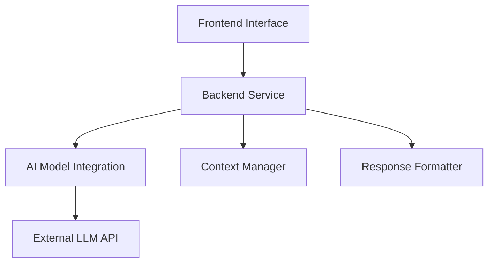

# AI Learning & Developer Productivity Assistant

The **AI Learning & Developer Productivity Assistant** is a robust, web-based conversational system designed to help developers learn concepts, debug code, and explore technical topics. Unlike standard chatbots, this system features a strictly typed three-tier architecture, context-aware memory management, and is verified through rigorous **Property-Based Testing** to ensure correctness and reliability.

## 📋 Table of Contents

* [Overview](#overview)
* [Architecture](#architecture)
* [Key Features](#key-features)
* [System Components](#system-components)
* [Data Models](#data-models)
* [Testing Strategy](#testing-strategy)
* [API Reference](#api-reference)
* [Getting Started](#getting-started)

## Overview

This system leverages an external AI language model to provide precise, context-aware answers. It acts as an intelligent intermediary that validates user input, manages conversation history (session context), optimizes prompts, and formats the output with syntax highlighting for maximum readability.

## Architecture

The system follows a client-server architecture with five distinct logical layers.



### Request Flow

1. **Frontend:** Captures user query.
2. **Backend:** Validates and sanitizes input.
3. **Context Manager:** Retrieves session history.
4. **AI Integration:** Constructs optimized prompts and calls External LLM.
5. **Response Formatter:** Structures text and highlights code.
6. **Frontend:** Renders the structured response.

## Key Features

* **Context Awareness:** Maintains multi-turn conversation history within sessions.
* **Smart Formatting:** Automatically detects code blocks and applies syntax highlighting; structures step-by-step explanations.
* **Ambiguity Resolution:** Identifies unclear queries and proactively asks clarifying questions.
* **Security First:** Strict input sanitization against XSS/Injection and secure data handling.
* **Resilience:** Graceful error handling for external API failures (timeouts, rate limits).

## System Components

### 1. Frontend Interface

* **Stack:** React (implied), TypeScript
* **Role:** Renders the chat UI, manages loading states, and handles formatted Markdown/Code display.

### 2. Backend Service

* **Role:** The central coordinator. Handles authentication, rate limiting, and routing (e.g., `POST /api/query`).

### 3. Context Manager

* **Role:** Manages the lifecycle of a session. It ensures the AI "remembers" previous context without retaining sensitive data indefinitely.

### 4. AI Model Integration

* **Role:** The abstraction layer for the LLM. It handles prompt engineering, retry logic, and API communication.

### 5. Response Formatter

* **Role:** Post-processes raw text into structured content (text, code blocks, lists) for the UI.

## Data Models

The system relies on strict TypeScript definitions for type safety.

**Query Model**

```typescript
interface Query {
  id: string;
  sessionId: string;
  content: string;
  timestamp: Date;
  category: 'learning' | 'debugging' | 'trending' | 'general';
}

```

**Response Model**

```typescript
interface FormattedResponse {
  id: string;
  queryId: string;
  content: StructuredContent; // Includes text, codeBlocks[], steps[], links[]
  timestamp: Date;
  processingTime: number;
}

```

## Testing Strategy

This project places a high emphasis on correctness. We utilize a dual testing approach:

### 1. Unit Testing

Standard tests for edge cases, integration points, and component logic using **Jest** and **React Testing Library**.

### 2. Property-Based Testing (PBT)

We define formal "properties" (truths) that the system must satisfy across *all* valid inputs (randomized generation). We use tools like **fast-check** (JS) or **Hypothesis** (Python) to validate these properties (min 100 iterations per property).

#### Verified Properties

| ID | Property | Validates Requirement |
| --- | --- | --- |
| **P1** | **Query Universality:** Valid responses generated regardless of category (learning vs debugging). | Req 1.1, 3.1 |
| **P2** | **Input Security:** Malicious/invalid content is strictly sanitized or rejected. | Req 1.5, 6.1 |
| **P3** | **Formatting Consistency:** Code blocks always have syntax highlighting; lists are structured. | Req 2.1, 7.2 |
| **P4** | **Step-by-Step Logic:** Concept explanations are always broken into sequential steps. | Req 2.2 |
| **P7** | **Context Preservation:** Multi-turn conversations retain history correctly. | Req 4.1 |
| **P9** | **Error Resilience:** External API failures result in graceful error messages, not crashes. | Req 5.5 |

*(See [design.md](design.md) for the full list of 12 properties)*

## API Reference

### Submit Query

**POST** `/api/query`

```json
{
  "sessionId": "uuid-v4",
  "content": "Explain React hooks"
}

```

### Health Check

**GET** `/api/health`
Returns system status and external dependency connectivity.

### Feedback

**POST** `/api/feedback`
Submit user feedback on response quality.

## Getting Started

### Prerequisites

* Node.js (v18+)
* API Key for LLM Provider (e.g., OpenAI, Anthropic)

### Installation

1. **Clone the repository**
```bash
git clone https://github.com/Shaun420/ai_for_bharat_impactX.git
cd ai_for_bharat_impactX

```


2. **Install dependencies**
```bash
npm install

```


3. **Environment Setup**
Create a `.env` file:
```env
LLM_API_KEY=<your_api_key>
PORT=3000

```


4. **Run Development Server**
```bash
npm run dev

```


5. **Run Tests (Crucial)**
To run the Property-Based Test suite:
```bash
npm run test:properties

```
