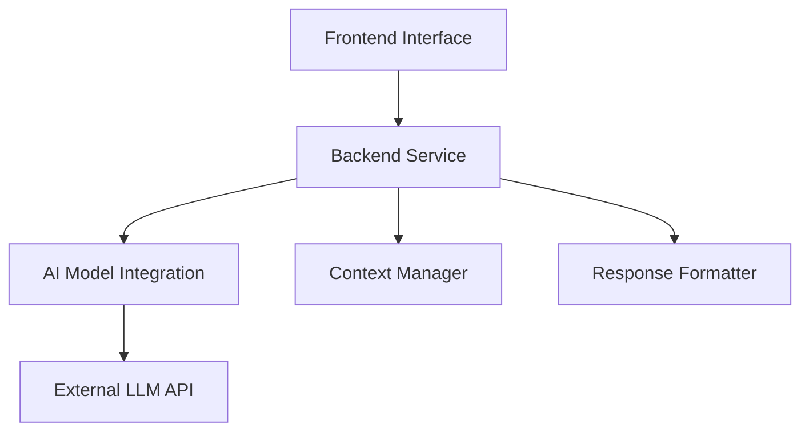

# Design Document

## Overview

The AI Learning & Developer Productivity Assistant is a web-based conversational system that leverages an AI language model to provide precise, context-aware answers for learning and development-related queries. The system follows a three-tier architecture with a frontend interface, backend service, and AI model integration layer.

## Architecture

The system uses a client-server architecture with the following layers:



### High-Level Flow
1. User submits query through frontend interface
2. Backend validates and processes the input
3. Context manager maintains conversation history
4. AI integration layer constructs optimized prompts
5. External LLM generates response
6. Response formatter structures the output
7. Frontend displays formatted response to user

## Components and Interfaces

### Frontend Component
**Responsibilities:**
- Render conversational chat interface
- Handle user input and validation
- Display formatted responses with syntax highlighting
- Manage UI state and loading indicators
- Provide responsive design across devices

**Key Interfaces:**
- `submitQuery(query: string): Promise<Response>`
- `displayResponse(response: FormattedResponse): void`
- `showLoadingState(): void`
- `handleError(error: ErrorResponse): void`

### Backend Service
**Responsibilities:**
- Receive and validate HTTP requests
- Coordinate between components
- Handle authentication and rate limiting
- Manage API endpoints and routing
- Process and return structured responses

**Key Interfaces:**
- `POST /api/query` - Submit new query
- `GET /api/health` - Health check endpoint
- `POST /api/feedback` - Optional feedback collection

### Context Manager
**Responsibilities:**
- Maintain conversation history within sessions
- Track user context and preferences
- Manage session lifecycle
- Provide context for AI model prompts

**Key Interfaces:**
- `addToContext(sessionId: string, query: string, response: string): void`
- `getContext(sessionId: string): ConversationContext`
- `clearContext(sessionId: string): void`
- `isContextRelevant(context: ConversationContext, newQuery: string): boolean`

### AI Model Integration
**Responsibilities:**
- Construct optimized prompts for the LLM
- Handle API communication with external AI service
- Process and validate AI responses
- Implement retry logic and error handling

**Key Interfaces:**
- `generateResponse(prompt: string, context: ConversationContext): Promise<AIResponse>`
- `constructPrompt(query: string, context: ConversationContext): string`
- `validateResponse(response: AIResponse): boolean`

### Response Formatter
**Responsibilities:**
- Structure AI responses for frontend consumption
- Add syntax highlighting for code blocks
- Format explanations and step-by-step breakdowns
- Handle different response types (text, code, lists)

**Key Interfaces:**
- `formatResponse(aiResponse: AIResponse): FormattedResponse`
- `highlightCode(code: string, language: string): string`
- `structureExplanation(text: string): StructuredContent`

## Data Models

### Query Model
```typescript
interface Query {
  id: string;
  sessionId: string;
  content: string;
  timestamp: Date;
  category: 'learning' | 'debugging' | 'trending' | 'general';
}
```

### Response Model
```typescript
interface FormattedResponse {
  id: string;
  queryId: string;
  content: StructuredContent;
  timestamp: Date;
  processingTime: number;
}

interface StructuredContent {
  text: string;
  codeBlocks?: CodeBlock[];
  steps?: string[];
  links?: ExternalLink[];
}
```

### Context Model
```typescript
interface ConversationContext {
  sessionId: string;
  history: QueryResponsePair[];
  userPreferences: UserPreferences;
  lastActivity: Date;
}

interface QueryResponsePair {
  query: Query;
  response: FormattedResponse;
}
```

Now I need to analyze the requirements for correctness properties. Let me use the prework tool:

<function_calls>
<invoke name="prework">
<parameter name="featureName">ai-learning-assistant
## Correctness Properties

*A property is a characteristic or behavior that should hold true across all valid executions of a system—essentially, a formal statement about what the system should do. Properties serve as the bridge between human-readable specifications and machine-verifiable correctness guarantees.*

Based on the prework analysis, I've identified several properties that can be combined for more comprehensive testing:

**Property Reflection:**
- Properties 1.1, 1.2, 3.1, and 3.2 all test query processing for different categories - these can be combined into one comprehensive property
- Properties 2.1, 2.3, and 7.2 all test response formatting - these can be combined
- Properties 4.1 and 4.3 both test conversation continuity - these can be combined
- Properties 6.1 and 6.2 both test input validation - these can be combined

### Property 1: Query Processing Universality
*For any* valid query regardless of category (learning, trending, programming, debugging), the system should generate a relevant response containing appropriate content for that query type.
**Validates: Requirements 1.1, 1.2, 3.1, 3.2**

### Property 2: Input Validation and Security
*For any* user input including malicious or invalid content, the system should validate and sanitize the input before processing, rejecting dangerous content with appropriate error messages.
**Validates: Requirements 1.4, 1.5, 6.1, 6.2**

### Property 3: Response Formatting Consistency
*For any* AI-generated response containing text, code, or structured content, the system should apply consistent formatting including syntax highlighting for code blocks and proper structure for explanations.
**Validates: Requirements 2.1, 2.3, 7.2**

### Property 4: Step-by-Step Explanation Structure
*For any* concept explanation query, the system should break down the response into digestible, sequential steps that build understanding progressively.
**Validates: Requirements 2.2**

### Property 5: Technical Term Context
*For any* response containing technical terminology, the system should provide appropriate context or definitions to ensure understanding.
**Validates: Requirements 2.5**

### Property 6: Clarification Request Logic
*For any* ambiguous query or debugging request lacking sufficient detail, the system should identify the ambiguity and ask relevant clarifying questions.
**Validates: Requirements 3.3, 4.2**

### Property 7: Conversation Context Preservation
*For any* multi-turn conversation within a session, the system should maintain context from previous exchanges and support natural conversation flow.
**Validates: Requirements 4.1, 4.3**

### Property 8: Session Isolation
*For any* new session initialization, the system should start with clean context independent of previous sessions.
**Validates: Requirements 4.4**

### Property 9: External Dependency Error Handling
*For any* external service failure (AI model unavailability), the system should provide appropriate error messaging without system failure.
**Validates: Requirements 5.5**

### Property 10: Data Privacy Compliance
*For any* user interaction, the system should not persist sensitive user data and should use secure protocols for external communications.
**Validates: Requirements 6.3, 6.4**

### Property 11: Security Event Logging
*For any* security-relevant event (failed validation, suspicious input), the system should log the event for monitoring purposes.
**Validates: Requirements 6.5**

### Property 12: User-Friendly Error Display
*For any* error condition, the system should display user-friendly error messages that help users understand and resolve issues.
**Validates: Requirements 7.4**

## Error Handling

The system implements comprehensive error handling across all layers:

### Input Validation Errors
- Empty or null queries
- Excessively long input (>10,000 characters)
- Malicious input patterns (SQL injection, XSS attempts)
- Invalid session identifiers

### External Service Errors
- AI model API timeouts or failures
- Network connectivity issues
- Rate limiting from external services
- Authentication failures with external APIs

### System Errors
- Memory or resource exhaustion
- Database connection failures
- Internal processing errors
- Configuration issues

### Error Response Format
All errors follow a consistent structure:
```typescript
interface ErrorResponse {
  error: {
    code: string;
    message: string;
    details?: string;
    timestamp: Date;
  };
}
```

## Testing Strategy

The system uses a dual testing approach combining unit tests and property-based tests for comprehensive coverage.

### Unit Testing
Unit tests focus on:
- Specific examples demonstrating correct behavior
- Edge cases and boundary conditions
- Integration points between components
- Error conditions and exception handling
- Mock external dependencies for isolated testing

### Property-Based Testing
Property tests validate universal properties across randomized inputs:
- Each property test runs minimum 100 iterations
- Tests use generated data to cover wide input ranges
- Each test references its corresponding design property
- Tag format: **Feature: ai-learning-assistant, Property {number}: {property_text}**

### Testing Framework Selection
- **Frontend**: Jest with React Testing Library for component testing
- **Backend**: Jest for Node.js or pytest for Python implementation
- **Property Testing**: fast-check (JavaScript) or Hypothesis (Python)
- **Integration**: Supertest for API testing
- **End-to-End**: Playwright for full user journey testing

### Test Configuration
- Property tests configured for minimum 100 iterations per property
- Unit test coverage target: 90% for critical paths
- Integration tests for all API endpoints
- Performance tests for response time requirements
- Security tests for input validation and injection prevention

### Continuous Integration
- All tests run on every pull request
- Property tests run with extended iteration counts in CI
- Performance benchmarks tracked over time
- Security scans integrated into build pipeline